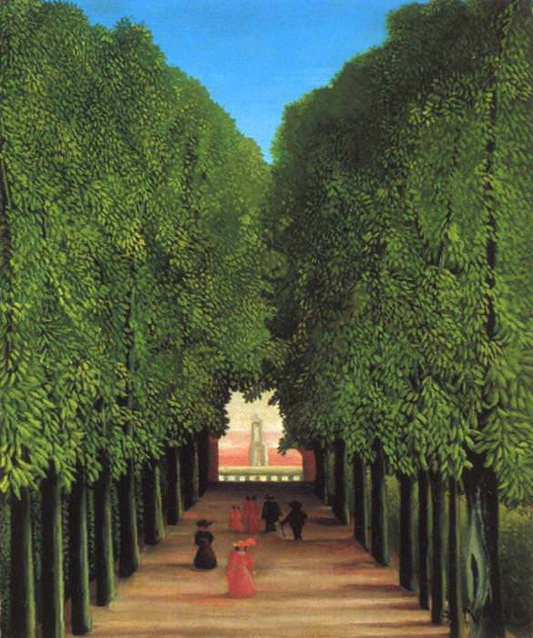

[🏠 Home](../../index.md)

# September 25

## 🧑‍🎨 Painting of the day

[Henri Rousseau](https://en.wikipedia.org/wiki/Henri_Rousseau) (Primitivism)

<button class="btn btn-success"
onclick=" window.open('https://lens.google.com/uploadbyurl?url=https://iretes.github.io/one-a-day/data/img/Henri_Rousseau_4.jpg','_blank')">
Search with Google Lens
</button>

## 🎼 Song of the day

> *Ziggy Stardust*
by David Bowie

 Written by Bowie.

Released in June , 1972.

<button class="btn btn-success"
onclick=" window.open('http://www.youtube.com/search?q=Ziggy Stardust by David Bowie','_blank')">
Search on YouTube
</button>

## 🏛️ UNESCO heritage site of the day

> *Seokguram Grotto and Bulguksa Temple*, Republic of Korea

Established in the 8th century on the slopes of Mount Toham, the Seokguram Grotto contains a monumental statue of the Buddha looking at the sea in the <em>bhumisparsha mudra</em> position. With the surrounding portrayals of gods, Bodhisattvas and disciples, all realistically and delicately sculpted in high and low relief, it is considered a masterpiece of Buddhist art in the Far East. The Temple of Bulguksa (built in 774) and the Seokguram Grotto form a religious architectural complex of exceptional significance.

<button class="btn btn-success"
onclick=" window.open('http://www.google.com/search?q=Seokguram Grotto and Bulguksa Temple','_blank')">
Search on Google
</button>

## 🗺️ Place of the day

<iframe
src="https://www.mapcrunch.com"
name="mapcrunch"
width="500"
height="500"
allowTransparency="true"
scrolling="no"
frameborder="0"
>
</iframe>
## 🎨 Color of the day

> *[Cyan (process)](https://en.wikipedia.org/wiki/Cyan#Process_cyan)*

&#9632;

## 🌿 Plant of the day

> *black eyed susan*

<button class="btn btn-success"
onclick=" window.open('http://www.google.com/search?q=black eyed susan','_blank')">
Search on Google
</button>

## 🧑‍🔬 Scientific discovery of the day

> *1614: John Napier: use of logarithms for calculation.*

<button class="btn btn-success"
onclick=" window.open('http://www.google.com/search?q=1614: John Napier: use of logarithms for calculation.','_blank')"> 
Search on Google
</button>

## 💭 Philosophical concept of the day

> *[Meaning](https://en.wikipedia.org/wiki/Meaning_(existential))*

## 🗣️ Saying of the day

> *For crying out loud*

For Christ's sake.
