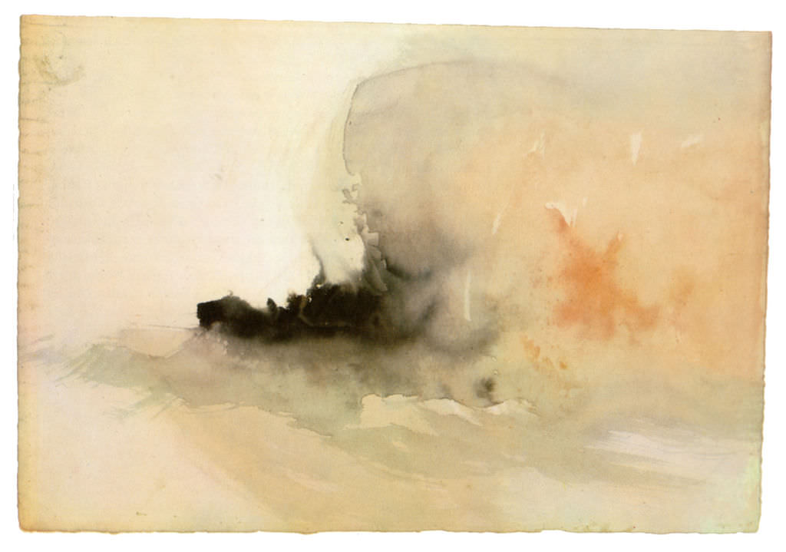

[🏠 Home](../../index.md)

# September 26

## 🧑‍🎨 Painting of the day

[William Turner](https://en.wikipedia.org/wiki/J._M._W._Turner) (Romanticism)

<button class="btn btn-success"
onclick=" window.open('https://lens.google.com/uploadbyurl?url=https://iretes.github.io/one-a-day/data/img/William_Turner_5.jpg','_blank')">
Search with Google Lens
</button>

## 🎼 Song of the day

> *Ill Take You There*
by The Staple Singers

 Written by Alvertis Isbell (Al Bell).

Released in June , 1972.

<button class="btn btn-success"
onclick=" window.open('http://www.youtube.com/search?q=Ill Take You There by The Staple Singers','_blank')">
Search on YouTube
</button>

## 🏛️ UNESCO heritage site of the day

> *Orkhon Valley Cultural Landscape*, Mongolia

The 121,967-ha Orkhon Valley Cultural Landscape encompasses an extensive area of pastureland on both banks of the Orkhon River and includes numerous archaeological remains dating back to the 6th century. The site also includes Kharkhorum, the 13th- and 14th-century capital of Chingis (Genghis) Khan’s vast Empire. Collectively the remains in the site reflect the symbiotic links between nomadic, pastoral societies and their administrative and religious centres, and the importance of the Orkhon valley in the history of central Asia. The grassland is still grazed by Mongolian nomadic pastoralists.

<button class="btn btn-success"
onclick=" window.open('http://www.google.com/search?q=Orkhon Valley Cultural Landscape','_blank')">
Search on Google
</button>

## 🗺️ Place of the day

<iframe
src="https://www.mapcrunch.com"
name="mapcrunch"
width="500"
height="500"
allowTransparency="true"
scrolling="no"
frameborder="0"
>
</iframe>
## 🎨 Color of the day

> *[Dandelion](https://en.wikipedia.org/wiki/List_of_Crayola_crayon_colors)*

&#9632;

## 🌿 Plant of the day

> *red birch*

<button class="btn btn-success"
onclick=" window.open('http://www.google.com/search?q=red birch','_blank')">
Search on Google
</button>

## 🧑‍🔬 Scientific discovery of the day

> *1665: Robert Hooke: discovers the cell.*

<button class="btn btn-success"
onclick=" window.open('http://www.google.com/search?q=1665: Robert Hooke: discovers the cell.','_blank')"> 
Search on Google
</button>

## 💭 Philosophical concept of the day

> *[Name](https://en.wikipedia.org/wiki/Name)*

## 🗣️ Saying of the day

> *I see you stand like greyhounds in the slips*

I see you are ready and anxious to depart.

## 🏳️‍🌈 International day

World -03itime Day, International Day for the Total Elimination of Nuclear Weapons.