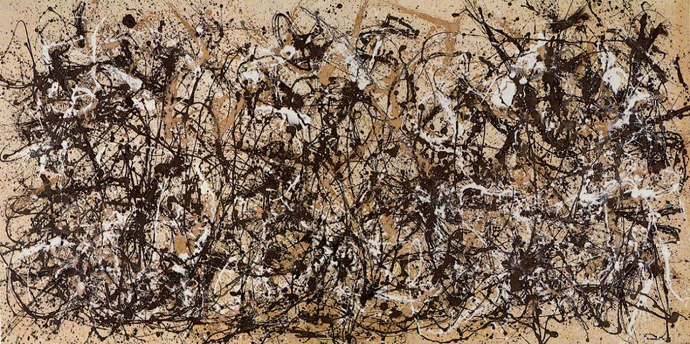

[🏠 Home](../../index.md)

# September 27

## 🧑‍🎨 Painting of the day

[Jackson Pollock](http://en.wikipedia.org/wiki/Jackson_Pollock) (Abstract Expressionism)

<button class="btn btn-success"
onclick=" window.open('https://lens.google.com/uploadbyurl?url=https://iretes.github.io/one-a-day/data/img/Jackson_Pollock_2.jpg','_blank')">
Search with Google Lens
</button>

## 🎼 Song of the day

> *Born in the U.S.A.*
by Bruce Springsteen

 Written by Springsteen.

Released in June , 1984.

<button class="btn btn-success"
onclick=" window.open('http://www.youtube.com/search?q=Born in the U.S.A. by Bruce Springsteen','_blank')">
Search on YouTube
</button>

## 🏛️ UNESCO heritage site of the day

> *Simien National Park*, Ethiopia

Massive erosion over the years on the Ethiopian plateau has created one of the most spectacular landscapes in the world, with jagged mountain peaks, deep valleys and sharp precipices dropping some 1,500 m. The park is home to some extremely rare animals such as the Gelada baboon, the Simien fox and the Walia ibex, a goat found nowhere else in the world.

<button class="btn btn-success"
onclick=" window.open('http://www.google.com/search?q=Simien National Park','_blank')">
Search on Google
</button>

## 🗺️ Place of the day

<iframe
src="https://www.mapcrunch.com"
name="mapcrunch"
width="500"
height="500"
allowTransparency="true"
scrolling="no"
frameborder="0"
>
</iframe>
## 🎨 Color of the day

> *[Dark green (X11)](https://en.wikipedia.org/wiki/Shades_of_green#Dark_green_(X11))*

&#9632;

## 🌿 Plant of the day

> *lettuce*

<button class="btn btn-success"
onclick=" window.open('http://www.google.com/search?q=lettuce','_blank')">
Search on Google
</button>

## 🧑‍🔬 Scientific discovery of the day

> *1858: Rudolf Virchow: cells can only arise from pre-existing cells.*

<button class="btn btn-success"
onclick=" window.open('http://www.google.com/search?q=1858: Rudolf Virchow: cells can only arise from pre-existing cells.','_blank')"> 
Search on Google
</button>

## 💭 Philosophical concept of the day

> *[Molyneux's Problem](https://en.wikipedia.org/wiki/Molyneux%27s_Problem)*

## 🗣️ Saying of the day

> *Whistle and flute*

Suit.

## 🏳️‍🌈 International day

World Tourism Day.