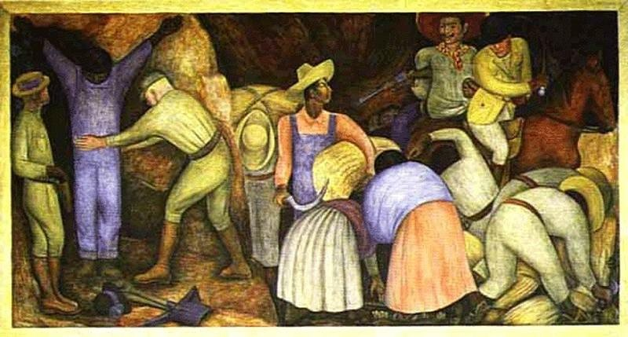

[🏠 Home](../../index.md)

# September 28

## 🧑‍🎨 Painting of the day

[Diego Rivera](http://en.wikipedia.org/wiki/Diego_Rivera) (Social Realism, Muralism)

<button class="btn btn-success"
onclick=" window.open('https://lens.google.com/uploadbyurl?url=https://iretes.github.io/one-a-day/data/img/Diego_Rivera_2.jpg','_blank')">
Search with Google Lens
</button>

## 🎼 Song of the day

> *Somebody to Love*
by Jefferson Airplane

 Written by Darby Slick.

Released in Feb. , 1967.

<button class="btn btn-success"
onclick=" window.open('http://www.youtube.com/search?q=Somebody to Love by Jefferson Airplane','_blank')">
Search on YouTube
</button>

## 🏛️ UNESCO heritage site of the day

> *Abbey of St Gall*, Switzerland

The Convent of St Gall, a perfect example of a great Carolingian monastery, was, from the 8th century to its secularization in 1805, one of the most important in Europe. Its library is one of the richest and oldest in the world and contains precious manuscripts such as the earliest-known architectural plan drawn on parchment. From 1755 to 1768, the conventual area was rebuilt in Baroque style. The cathedral and the library are the main features of this remarkable architectural complex, reflecting 12 centuries of continuous activity.

<button class="btn btn-success"
onclick=" window.open('http://www.google.com/search?q=Abbey of St Gall','_blank')">
Search on Google
</button>

## 🗺️ Place of the day

<iframe
src="https://www.mapcrunch.com"
name="mapcrunch"
width="500"
height="500"
allowTransparency="true"
scrolling="no"
frameborder="0"
>
</iframe>
## 🎨 Color of the day

> *[Café noir](https://en.wikipedia.org/wiki/Coffee_(color)#Café_Noir)*

&#9632;

## 🌿 Plant of the day

> *trailing red huckleberry*

<button class="btn btn-success"
onclick=" window.open('http://www.google.com/search?q=trailing red huckleberry','_blank')">
Search on Google
</button>

## 🧑‍🔬 Scientific discovery of the day

> *3rd century BC: Archimedes calculates tangents to non-trigonometric curves.*

<button class="btn btn-success"
onclick=" window.open('http://www.google.com/search?q=3rd century BC: Archimedes calculates tangents to non-trigonometric curves.','_blank')"> 
Search on Google
</button>

## 💭 Philosophical concept of the day

> *[Sub specie aeternitatis](https://en.wikipedia.org/wiki/Sub_specie_aeternitatis)*

## 🗣️ Saying of the day

> *As fit as a fiddle*

To be 'as fit as a fiddle' is to be very fit and well.

## 🏳️‍🌈 International day

International Day for Universal Access to Information.