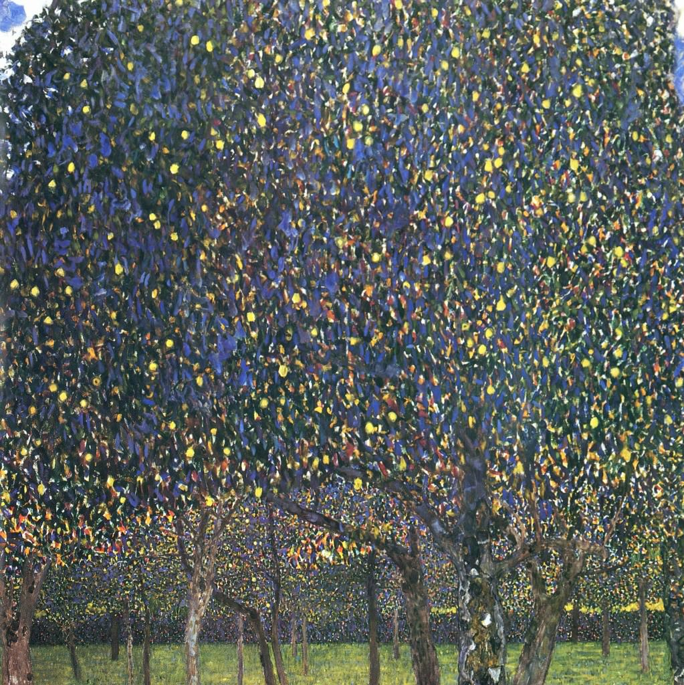

[🏠 Home](../../index.md)

# September 29

## 🧑‍🎨 Painting of the day

[Gustav Klimt](http://en.wikipedia.org/wiki/Gustav_Klimt) (Symbolism, Art Nouveau)

<button class="btn btn-success"
onclick=" window.open('https://lens.google.com/uploadbyurl?url=https://iretes.github.io/one-a-day/data/img/Gustav_Klimt_7.jpg','_blank')">
Search with Google Lens
</button>

## 🎼 Song of the day

> *Something*
by The Beatles

 Written by George Harrison.

Released in Oct. , 1969.

<button class="btn btn-success"
onclick=" window.open('http://www.youtube.com/search?q=Something by The Beatles','_blank')">
Search on YouTube
</button>

## 🏛️ UNESCO heritage site of the day

> *Jodrell Bank Observatory*, United Kingdom of Great Britain and Northern Ireland

Located in a rural area of northwest England, free from radio interference, Jodrell Bank is one of the world's leading radio astronomy observatories. At the beginning of its use, in 1945, the property housed research on cosmic rays detected by radar echoes. This observatory, which is still in operation, includes several radio telescopes and working buildings, including engineering sheds and the Control Building. Jodrell Bank has had substantial scientific impact in fields such as the study of meteors and the moon, the discovery of quasars, quantum optics, and the tracking of spacecraft. This exceptional technological ensemble illustrates the transition from traditional optical astronomy to radio astronomy (1940s to 1960s), which led to radical changes in the understanding of the universe.

<button class="btn btn-success"
onclick=" window.open('http://www.google.com/search?q=Jodrell Bank Observatory','_blank')">
Search on Google
</button>

## 🗺️ Place of the day

<iframe
src="https://www.mapcrunch.com"
name="mapcrunch"
width="500"
height="500"
allowTransparency="true"
scrolling="no"
frameborder="0"
>
</iframe>
## 🎨 Color of the day

> *[School bus yellow](https://en.wikipedia.org/wiki/School_bus_yellow)*

&#9632;

## 🌿 Plant of the day

> *white tansy*

<button class="btn btn-success"
onclick=" window.open('http://www.google.com/search?q=white tansy','_blank')">
Search on Google
</button>

## 🧑‍🔬 Scientific discovery of the day

> *499: Aryabhata discovers Bezout's identity, a foundational result to the theory of principal ideal domains.*

<button class="btn btn-success"
onclick=" window.open('http://www.google.com/search?q=499: Aryabhata discovers Bezout s identity, a foundational result to the theory of principal ideal domains.','_blank')"> 
Search on Google
</button>

## 💭 Philosophical concept of the day

> *[Percept](https://en.wikipedia.org/wiki/Percept)*

## 🗣️ Saying of the day

> *Pip - Get the/got the /have the *

Become irritated or annoyed. 

## 🏳️‍🌈 International day

International Day of Awareness of Food Loss and Waste.