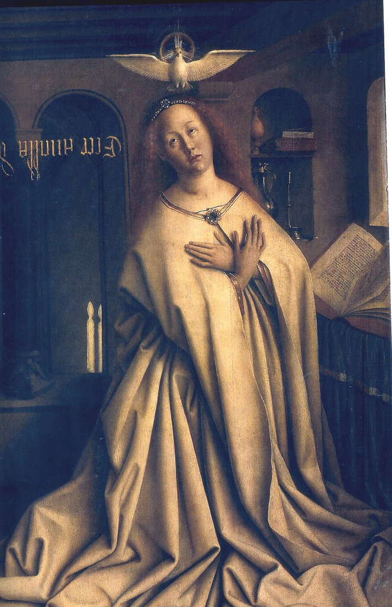

[🏠 Home](../../index.md)

# September 3

## 🧑‍🎨 Painting of the day

[Jan van Eyck](http://en.wikipedia.org/wiki/Jan_van_Eyck) (Northern Renaissance)

<button class="btn btn-success"
onclick=" window.open('https://lens.google.com/uploadbyurl?url=https://iretes.github.io/one-a-day/data/img/Jan_van_Eyck_6.jpg','_blank')">
Search with Google Lens
</button>

## 🎼 Song of the day

> *Bizarre Love Triangle*
by New Order

 Written by Bernard Albrecht, Gillian Gilbert, Peter Hook, Stephen Morris.

Released in Oct, 1986.

<button class="btn btn-success"
onclick=" window.open('http://www.youtube.com/search?q=Bizarre Love Triangle by New Order','_blank')">
Search on YouTube
</button>

## 🏛️ UNESCO heritage site of the day

> *Manas Wildlife Sanctuary*, India

On a gentle slope in the foothills of the Himalayas, where wooded hills give way to alluvial grasslands and tropical forests, the Manas sanctuary is home to a great variety of wildlife, including many endangered species, such as the tiger, pygmy hog, Indian rhinoceros and Indian elephant.

<button class="btn btn-success"
onclick=" window.open('http://www.google.com/search?q=Manas Wildlife Sanctuary','_blank')">
Search on Google
</button>

## 🗺️ Place of the day

<iframe
src="https://www.mapcrunch.com"
name="mapcrunch"
width="500"
height="500"
allowTransparency="true"
scrolling="no"
frameborder="0"
>
</iframe>
## 🎨 Color of the day

> *[Purple](https://en.wikipedia.org/wiki/Shades_of_purple#Purple)*

&#9632;

## 🌿 Plant of the day

> *canada root*

<button class="btn btn-success"
onclick=" window.open('http://www.google.com/search?q=canada root','_blank')">
Search on Google
</button>

## 🧑‍🔬 Scientific discovery of the day

> *1929: Edwin Hubble: Hubble's law of the expanding universe*

<button class="btn btn-success"
onclick=" window.open('http://www.google.com/search?q=1929: Edwin Hubble: Hubble s law of the expanding universe','_blank')">
Search on Google
</button>

## 💭 Philosophical concept of the day

> *[Class consciousness](https://en.wikipedia.org/wiki/Class_consciousness)*

## 🗣️ Saying of the day

> *Boys will be boys*

The proverbial saying 'boys will be boys' is used to express resignation at, or even encouragement of,  the bad behaviour of boys, imagining it to be an inevitable consequence of their gender.
