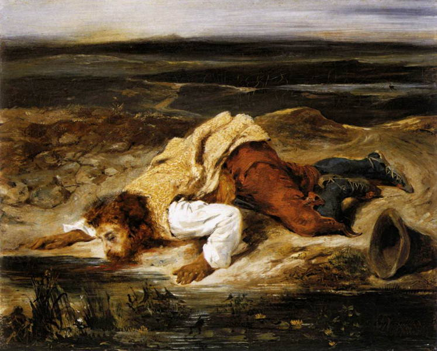

[🏠 Home](../../index.md)

# September 30

## 🧑‍🎨 Painting of the day

[Eugene Delacroix](https://en.wikipedia.org/wiki/Eugène_Delacroix) (Romanticism)

<button class="btn btn-success"
onclick=" window.open('https://lens.google.com/uploadbyurl?url=https://iretes.github.io/one-a-day/data/img/Eugene_Delacroix_4.jpg','_blank')">
Search with Google Lens
</button>

## 🎼 Song of the day

> *Sweet Little Sixteen*
by Chuck Berry

 Written by Berry.

Released in Jan. , 1958.

<button class="btn btn-success"
onclick=" window.open('http://www.youtube.com/search?q=Sweet Little Sixteen by Chuck Berry','_blank')">
Search on YouTube
</button>

## 🏛️ UNESCO heritage site of the day

> *Historic Centre of Oaxaca and Archaeological Site of Monte Albán*, Mexico

Inhabited over a period of 1,500 years by a succession of peoples – Olmecs, Zapotecs and Mixtecs – the terraces, dams, canals, pyramids and artificial mounds of Monte Albán were literally carved out of the mountain and are the symbols of a sacred topography. The nearby city of Oaxaca, which is built on a grid pattern, is a good example of Spanish colonial town planning. The solidity and volume of the city's buildings show that they were adapted to the earthquake-prone region in which these architectural gems were constructed.

<button class="btn btn-success"
onclick=" window.open('http://www.google.com/search?q=Historic Centre of Oaxaca and Archaeological Site of Monte Albán','_blank')">
Search on Google
</button>

## 🗺️ Place of the day

<iframe
src="https://www.mapcrunch.com"
name="mapcrunch"
width="500"
height="500"
allowTransparency="true"
scrolling="no"
frameborder="0"
>
</iframe>
## 🎨 Color of the day

> *[British racing green](https://en.wikipedia.org/wiki/British_racing_green)*

&#9632;

## 🌿 Plant of the day

> *poison flower*

<button class="btn btn-success"
onclick=" window.open('http://www.google.com/search?q=poison flower','_blank')">
Search on Google
</button>

## 🧑‍🔬 Scientific discovery of the day

> *2019: Scientists report, for the first time, the use of the CRISPR technology to edit human genes to treat cancer patients with whom standard treatments were not successful.*

<button class="btn btn-success"
onclick=" window.open('http://www.google.com/search?q=2019: Scientists report, for the first time, the use of the CRISPR technology to edit human genes to treat cancer patients with whom standard treatments were not successful.','_blank')"> 
Search on Google
</button>

## 💭 Philosophical concept of the day

> *[Adiaphora](https://en.wikipedia.org/wiki/Adiaphora)*

## 🗣️ Saying of the day

> *Happy as a clam*

Very happy and content.

## 🏳️‍🌈 International day

International Translation Day.