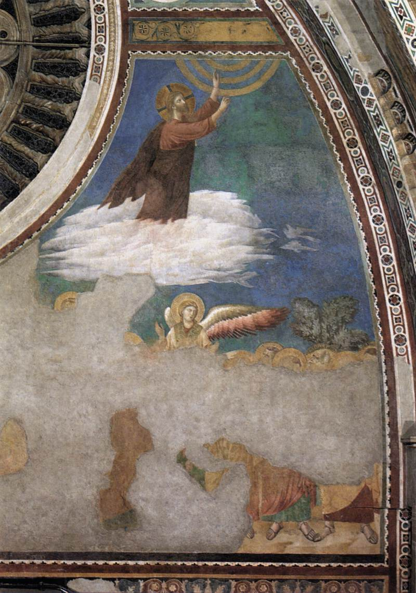

[🏠 Home](../../index.md)

# September 4

## 🧑‍🎨 Painting of the day

[Giotto di Bondone](http://en.wikipedia.org/wiki/Giotto_di_Bondone) (Proto Renaissance)

<button class="btn btn-success"
onclick=" window.open('https://lens.google.com/uploadbyurl?url=https://iretes.github.io/one-a-day/data/img/Giotto_di_Bondone_1.jpg','_blank')">
Search with Google Lens
</button>

## 🎼 Song of the day

> *Loser*
by Beck

 Written by Beck Hansen.

Released in March, 1993.

<button class="btn btn-success"
onclick=" window.open('http://www.youtube.com/search?q=Loser by Beck','_blank')">
Search on YouTube
</button>

## 🏛️ UNESCO heritage site of the day

> *Petroglyphic Complexes of the Mongolian Altai*, Mongolia

The numerous rock carvings and funerary monuments found in these three sites illustrate the development of culture in Mongolia over a period of 12,000 years. The earliest images reflect a time (11,000 - 6,000 BC) when the area was partly forested and the valley provided a habitat for hunters of large game. Later images show the transition to herding as the dominant way of life. The most recent images show the transition to a horse-dependent nomadic lifestyle during the early 1st millennium BC, the Scythian period and the later Turkic period (7th and 8th centuries AD). The carvings contribute valuably to our understanding of pre-historic communities in northern Asia.

<button class="btn btn-success"
onclick=" window.open('http://www.google.com/search?q=Petroglyphic Complexes of the Mongolian Altai','_blank')">
Search on Google
</button>

## 🗺️ Place of the day

<iframe
src="https://www.mapcrunch.com"
name="mapcrunch"
width="500"
height="500"
allowTransparency="true"
scrolling="no"
frameborder="0"
>
</iframe>
## 🎨 Color of the day

> *[Rufous](https://en.wikipedia.org/wiki/Rufous)*

&#9632;

## 🌿 Plant of the day

> *rose milkweed*

<button class="btn btn-success"
onclick=" window.open('http://www.google.com/search?q=rose milkweed','_blank')">
Search on Google
</button>

## 🧑‍🔬 Scientific discovery of the day

> *1673: Christiaan Huygens: first study of oscillating system and design of pendulum clocks*

<button class="btn btn-success"
onclick=" window.open('http://www.google.com/search?q=1673: Christiaan Huygens: first study of oscillating system and design of pendulum clocks','_blank')"> 
Search on Google
</button>

## 💭 Philosophical concept of the day

> *[Ti](https://en.wikipedia.org/wiki/Ti_(concept))*

## 🗣️ Saying of the day

> *Look before you leap*

Check that you are clear what is ahead of you before making a decision that you cannot go back on.
