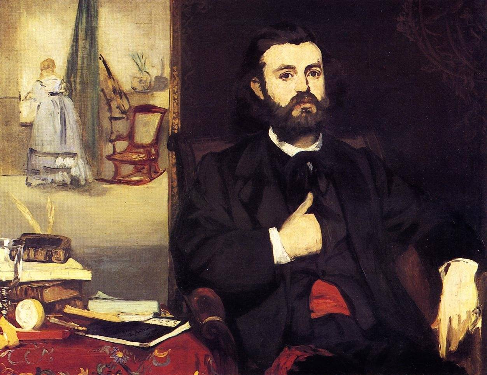

[🏠 Home](../../index.md)

# September 5

## 🧑‍🎨 Painting of the day

[Edouard Manet](http://en.wikipedia.org/wiki/Édouard_Manet) (Realism, Impressionism)

<button class="btn btn-success"
onclick=" window.open('https://lens.google.com/uploadbyurl?url=https://iretes.github.io/one-a-day/data/img/Edouard_Manet_3.jpg','_blank')">
Search with Google Lens
</button>

## 🎼 Song of the day

> *Flash Light*
by Parliament

 Written by George Clinton, Bernie Worrell, Bootsy Collins.

Released in Dec, 1977.

<button class="btn btn-success"
onclick=" window.open('http://www.youtube.com/search?q=Flash Light by Parliament','_blank')">
Search on YouTube
</button>

## 🏛️ UNESCO heritage site of the day

> *Rietveld Schröderhuis (Rietveld Schröder House)*, Netherlands

The Rietveld Schröder House in Utrecht was commissioned by Ms Truus Schröder-Schräder, designed by the architect Gerrit Thomas Rietveld, and built in 1924. This small family house, with its interior, the flexible spatial arrangement, and the visual and formal qualities, was a manifesto of the ideals of the De Stijl group of artists and architects in the Netherlands in the 1920s, and has since been considered one of the icons of the Modern Movement in architecture.

<button class="btn btn-success"
onclick=" window.open('http://www.google.com/search?q=Rietveld Schröderhuis (Rietveld Schröder House)','_blank')">
Search on Google
</button>

## 🗺️ Place of the day

<iframe
src="https://www.mapcrunch.com"
name="mapcrunch"
width="500"
height="500"
allowTransparency="true"
scrolling="no"
frameborder="0"
>
</iframe>
## 🎨 Color of the day

> *[Heat Wave](https://en.wikipedia.org/wiki/List_of_Crayola_crayon_colors#Extreme_Twistables_colors)*

&#9632;

## 🌿 Plant of the day

> *pineapple*

<button class="btn btn-success"
onclick=" window.open('http://www.google.com/search?q=pineapple','_blank')">
Search on Google
</button>

## 🧑‍🔬 Scientific discovery of the day

> *2021: In July Blue Origin became the first spaceflight company to launch a fully automated spacecraft with civilian passengers into space, carrying its founder Jeff Bezos and three others. Two of the flight's crew members, Dutch student Oliver Daemen (age 18) and American aviator Wally Funk (age 82), became both the youngest and oldest people respectively to go to space (Funk's record was beaten nearly 3 month's later when actor William Shatner entered space onboard Blue Origin NS-18, at the age of 90).*

<button class="btn btn-success"
onclick=" window.open('http://www.google.com/search?q=2021: In July Blue Origin became the first spaceflight company to launch a fully automated spacecraft with civilian passengers into space, carrying its founder Jeff Bezos and three others. Two of the flight s crew members, Dutch student Oliver Daemen (age 18) and American aviator Wally Funk (age 82), became both the youngest and oldest people respectively to go to space (Funk s record was beaten nearly 3 month s later when actor William Shatner entered space onboard Blue Origin NS-18, at the age of 90).','_blank')">
Search on Google
</button>

## 💭 Philosophical concept of the day

> *[Involution](https://en.wikipedia.org/wiki/Involution_(philosophy))*

## 🗣️ Saying of the day

> *Ship shape and Bristol fashion*

If something is  'ship-shape and Bristol fashion' it is in first-class order.

## 🏳️‍🌈 International day

International Day of Charity.