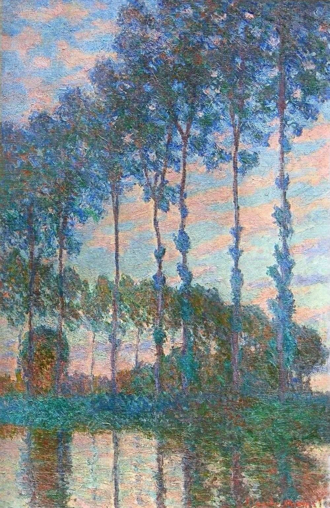

[🏠 Home](../../index.md)

# September 6

## 🧑‍🎨 Painting of the day

[Claude Monet](http://en.wikipedia.org/wiki/Claude_Monet) (Impressionism)

<button class="btn btn-success"
onclick=" window.open('https://lens.google.com/uploadbyurl?url=https://iretes.github.io/one-a-day/data/img/Claude_Monet_1.jpg','_blank')">
Search with Google Lens
</button>

## 🎼 Song of the day

> *Hey Joe*
by The Jimi Hendrix Experience

 Written by William Roberts.

Released in Dec, 1966.

<button class="btn btn-success"
onclick=" window.open('http://www.youtube.com/search?q=Hey Joe by The Jimi Hendrix Experience','_blank')">
Search on YouTube
</button>

## 🏛️ UNESCO heritage site of the day

> *Rideau Canal*, Canada

The Rideau Canal, a monumental early 19th-century construction covering 202 km of the Rideau and Cataraqui rivers from Ottawa south to Kingston Harbour on Lake Ontario, was built primarily for strategic military purposes at a time when Great Britain and the United States vied for control of the region. The site, one of the first canals to be designed specifically for steam-powered vessels, also features an ensemble of fortifications. It is the best-preserved example of a slackwater canal in North America, demonstrating the use of this European technology on a large scale. It is the only canal dating from the great North American canal-building era of the early 19th century to remain operational along its original line with most of its structures intact.

<button class="btn btn-success"
onclick=" window.open('http://www.google.com/search?q=Rideau Canal','_blank')">
Search on Google
</button>

## 🗺️ Place of the day

<iframe
src="https://www.mapcrunch.com"
name="mapcrunch"
width="500"
height="500"
allowTransparency="true"
scrolling="no"
frameborder="0"
>
</iframe>
## 🎨 Color of the day

> *[Neon fuchsia](https://en.wikipedia.org/wiki/Fuchsia_(color)#Neon_fuchsia)*

&#9632;

## 🌿 Plant of the day

> *garlic*

<button class="btn btn-success"
onclick=" window.open('http://www.google.com/search?q=garlic','_blank')">
Search on Google
</button>

## 🧑‍🔬 Scientific discovery of the day

> *1842: Christian Doppler: Doppler effect.*

<button class="btn btn-success"
onclick=" window.open('http://www.google.com/search?q=1842: Christian Doppler: Doppler effect.','_blank')"> 
Search on Google
</button>

## 💭 Philosophical concept of the day

> *[Right to exist](https://en.wikipedia.org/wiki/Right_to_exist)*

## 🗣️ Saying of the day

> *Okay*

Satisfactory - all correct. 
