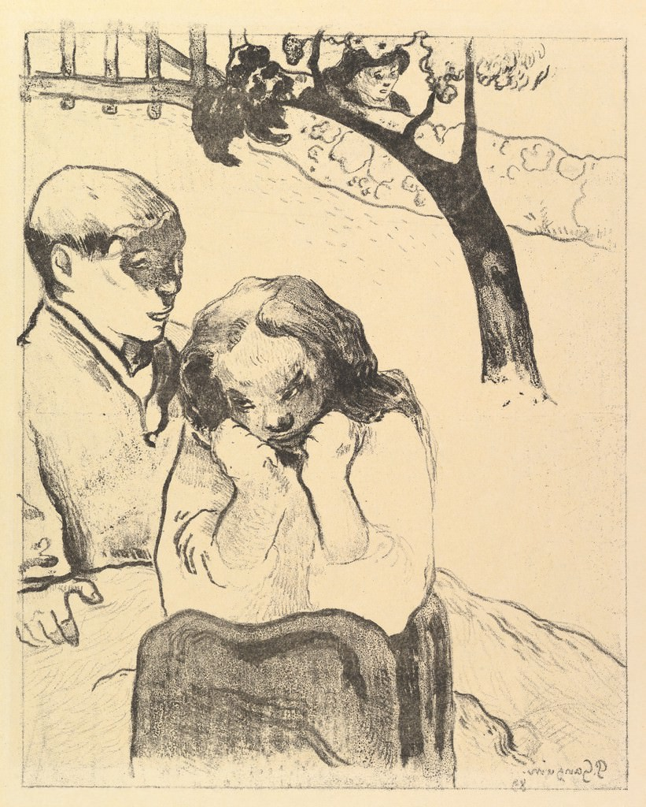

[🏠 Home](../../index.md)

# September 7

## 🧑‍🎨 Painting of the day

[Paul Gauguin](http://en.wikipedia.org/wiki/Paul_Gauguin) (Symbolism, Post-Impressionism)

<button class="btn btn-success"
onclick=" window.open('https://lens.google.com/uploadbyurl?url=https://iretes.github.io/one-a-day/data/img/Paul_Gauguin_5.jpg','_blank')">
Search with Google Lens
</button>

## 🎼 Song of the day

> *Black Dog*
by Led Zeppelin

 Written by Jimmy Page, Robert Plant, John Paul Jones.

Released in Nov. , 1971.

<button class="btn btn-success"
onclick=" window.open('http://www.youtube.com/search?q=Black Dog by Led Zeppelin','_blank')">
Search on YouTube
</button>

## 🏛️ UNESCO heritage site of the day

> *Royal Tombs of the Joseon Dynasty*, Republic of Korea

The Royal Tombs of the Joseon Dynasty form a collection of 40 tombs scattered over 18 locations. Built over five centuries, from 1408 to 1966, the tombs honoured the memory of ancestors, showed respect for their achievements, asserted royal authority, protected ancestral spirits from evil and provided protection from vandalism. Spots of outstanding natural beauty were chosen for the tombs which typically have their back protected by a hill as they face south toward water and, ideally, layers of mountain ridges in the distance. Alongside the burial area, the royal tombs feature a ceremonial area and an entrance. In addition to the burial mounds, associated buildings that are an integral part of the tombs include a T-shaped wooden shrine, a shed for stele, a royal kitchen and a guards&rsquo; house, a red-spiked gate and the tomb keeper&rsquo;s house. The grounds are adorned on the outside with a range of stone objects including figures of people and animals. The Joseon Tombs completes the 5,000 year history of royal tombs architecture in the Korean peninsula.

<button class="btn btn-success"
onclick=" window.open('http://www.google.com/search?q=Royal Tombs of the Joseon Dynasty','_blank')">
Search on Google
</button>

## 🗺️ Place of the day

<iframe
src="https://www.mapcrunch.com"
name="mapcrunch"
width="500"
height="500"
allowTransparency="true"
scrolling="no"
frameborder="0"
>
</iframe>
## 🎨 Color of the day

> *[Magenta (dye)](https://en.wikipedia.org/wiki/Shades_of_magenta#Magenta_dye_(original_variation)_(1860))*

&#9632;

## 🌿 Plant of the day

> *dye leaves*

<button class="btn btn-success"
onclick=" window.open('http://www.google.com/search?q=dye leaves','_blank')">
Search on Google
</button>

## 🧑‍🔬 Scientific discovery of the day

> *1864: James Clerk Maxwell: Theory of electromagnetism.*

<button class="btn btn-success"
onclick=" window.open('http://www.google.com/search?q=1864: James Clerk Maxwell: Theory of electromagnetism.','_blank')"> 
Search on Google
</button>

## 💭 Philosophical concept of the day

> *[Notion](https://en.wikipedia.org/wiki/Notion_(philosophy))*

## 🗣️ Saying of the day

> *Not my cup of tea*

Something or someone that one finds pleasing.

## 🏳️‍🌈 International day

International Day of Police Cooperation, World Duchenne Awareness Day, International Day of Clean Air for Blue Skies.