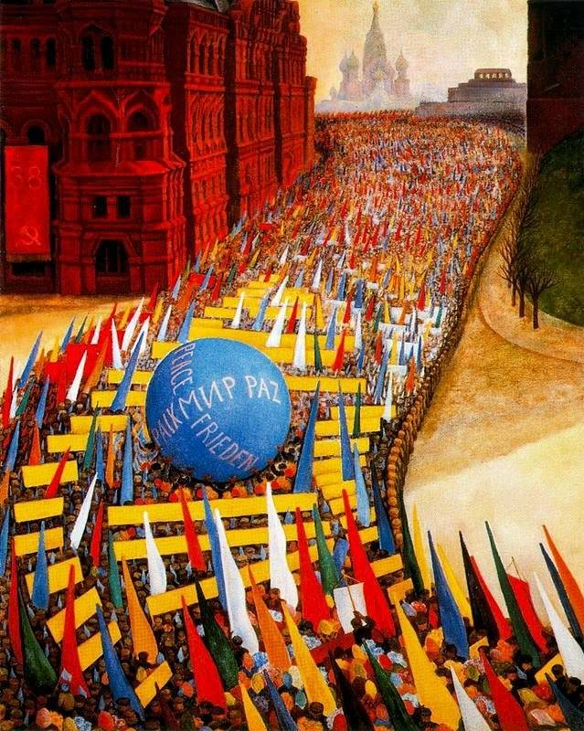

[🏠 Home](../../index.md)

# September 8

## 🧑‍🎨 Painting of the day

[Diego Rivera](http://en.wikipedia.org/wiki/Diego_Rivera) (Social Realism, Muralism)

<button class="btn btn-success"
onclick=" window.open('https://lens.google.com/uploadbyurl?url=https://iretes.github.io/one-a-day/data/img/Diego_Rivera_1.jpg','_blank')">
Search with Google Lens
</button>

## 🎼 Song of the day

> *Tired of Being Alone*
by Al Green

 Written by Green.

Released in July , 1971.

<button class="btn btn-success"
onclick=" window.open('http://www.youtube.com/search?q=Tired of Being Alone by Al Green','_blank')">
Search on YouTube
</button>

## 🏛️ UNESCO heritage site of the day

> *Pontcysyllte Aqueduct and Canal*, United Kingdom of Great Britain and Northern Ireland

Situated in north-eastern Wales, the 18 kilometre long Pontcysyllte Aqueduct and Canal is a feat of civil engineering of the Industrial Revolution, completed in the early years of the 19th century. Covering a difficult geographical setting, the building of the canal required substantial, bold civil engineering solutions, especially as it was built without using locks. The aqueduct is a pioneering masterpiece of engineering and monumental metal architecture, conceived by the celebrated civil engineer Thomas Telford. The use of both cast and wrought iron in the aqueduct enabled the construction of arches that were light and d strong, producing an overall effect that is both monumental and elegant. The property is inscribed as a masterpiece of creative genius, and as a remarkable synthesis of expertise already acquired in Europe. It is also recognized as an innovative ensemble that inspired many projects all over the world.

<button class="btn btn-success"
onclick=" window.open('http://www.google.com/search?q=Pontcysyllte Aqueduct and Canal','_blank')">
Search on Google
</button>

## 🗺️ Place of the day

<iframe
src="https://www.mapcrunch.com"
name="mapcrunch"
width="500"
height="500"
allowTransparency="true"
scrolling="no"
frameborder="0"
>
</iframe>
## 🎨 Color of the day

> *[Rose Pompadour](https://en.wikipedia.org/wiki/Shades_of_pink#Rose_Pompadour)*

&#9632;

## 🌿 Plant of the day

> *vanilla orchid*

<button class="btn btn-success"
onclick=" window.open('http://www.google.com/search?q=vanilla orchid','_blank')">
Search on Google
</button>

## 🧑‍🔬 Scientific discovery of the day

> *16th century: Lodovico Ferrari solves the general quartic equation (by reducing it to the case with zero quartic term).*

<button class="btn btn-success"
onclick=" window.open('http://www.google.com/search?q=16th century: Lodovico Ferrari solves the general quartic equation (by reducing it to the case with zero quartic term).','_blank')"> 
Search on Google
</button>

## 💭 Philosophical concept of the day

> *[Philosophical analysis](https://en.wikipedia.org/wiki/Philosophical_analysis)*

## 🗣️ Saying of the day

> *Wreak havoc *

It isn't surprising that some people get this phrase wrong and assume that it is 'wreck havoc'. After all 'havoc' and 'wreckage' usually belong together. However, the correct spelling is 'wreak havoc', which means, 'inflict or create damage'.

## 🏳️‍🌈 International day

International Literacy Day.